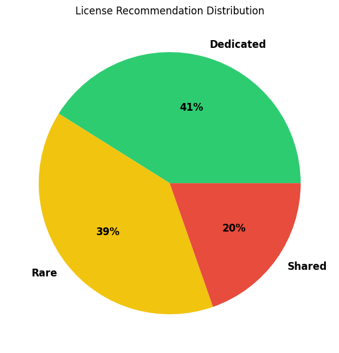

# Revit License Usage Analysis

This project analyzes Revit license usage within our company to enable **data-driven decisions** about license purchasing, optimize costs, and ensure uninterrupted access for key users.  
By examining employee login/logout patterns across months, we identified usage clusters, optimized license allocation, and quantified potential annual savings.

---

## Project Goals

- **Identify power users, shared users, and rare users of Revit**
- **Visualize usage patterns**: per user, per month
- **Recommend the optimal number of licenses** required for business needs
- **Estimate the cost impact** of a data-driven license strategy

---

## Methodology

1. **Data Collection & Processing**
   - Parsed Revit license logs to extract user activity (logins, logouts, denials).
   - Cleaned and transformed raw logs to structured data (user ID, session times, usage duration).

2. **Analysis**
   - Aggregated usage **per user, per month** to account for real project work cycles.
   - Calculated total, average, and active months per user.
   - Classified users into:
     - **Dedicated:** Regular, heavy Revit users needing full-time access.
     - **Shared:** Moderate, periodic users who can share licenses.
     - **Rare:** Occasional users suitable for floating or temporary licenses.
   - Simulated various license pooling strategies (e.g., shared pool at 50% concurrency).

3. **Business Impact**
   - Compared the current “all-users” license model with the optimized allocation.
   - Quantified potential **annual savings** by switching to an optimized license plan.

---

## Key Results

- **Clear segmentation of user base**: Dedicated (full-time), Shared (pool), and Rare users.
- **Optimal license allocation** can reduce annual license costs by over 49% while maintaining productivity for core staff.
- **Data-driven recommendations** help avoid over-purchasing and under-provisioning.

---

## Key Visualizations

**1. License Recommendation Distribution**

**2. Recommended License Allocation**

**3. User Classification by Average Monthly Hours and Active Months**

---

## Next Steps

- Incorporate user role/project information for even more accurate forecasting.
- Automate monthly reporting for ongoing optimization.
- Expand analysis to other design software for complete license management.

